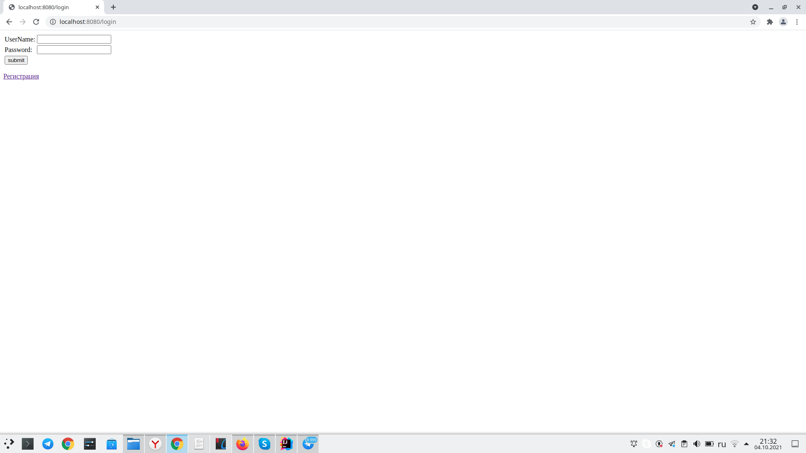
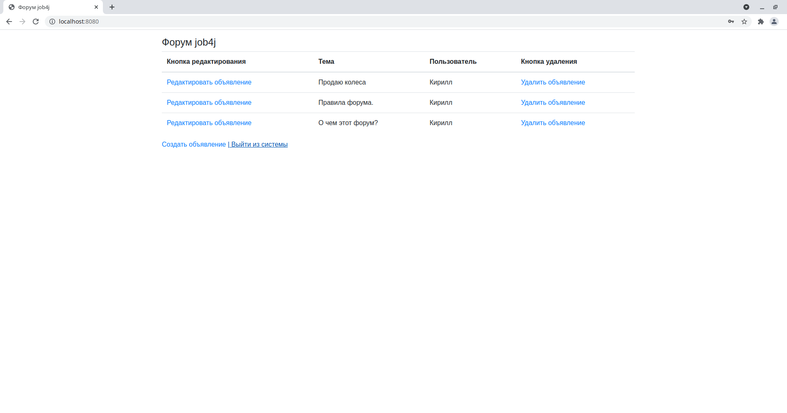

Spring Boot application (приложение Spring Boot)
Использую в качестве работы с БД: Spring DATA
Использую для работы с Security: Spring Security
Контроль версий: Git
Страницы view: .jsp
Подключена тестовая БД: H2
Подключена Heroku

1. Проект форум (пока в разработке) - приложение в котором будет функционировать форум, есть авторизация, есть регистрация,
будет возможность перейти по ссылке по названию в саму тему и там писать комменты для общения между форумчанами.
Вот начальные фото данного проекта:
   1. Страница регистрации (промежуточный вид):
[]
   2. Страница авторизации (промежуточный вид):
[]
   3. Основная страница (промежуточный вариант):
[]
2. Сборка и компоновка пока в разарботке
3. Использование предполагается в качестве форума с возможностью добавление тем и 
коментариев для авторизованных пользователей 
4. Мои контакты:
Телефон, telegram, WhatsApp: 8 961 692 75 95
email: evgeniysanich@mail.ru